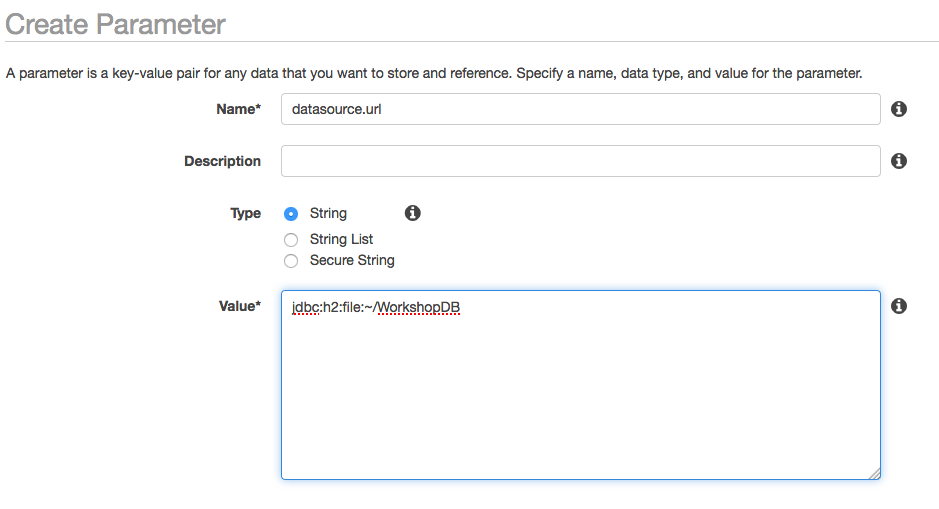
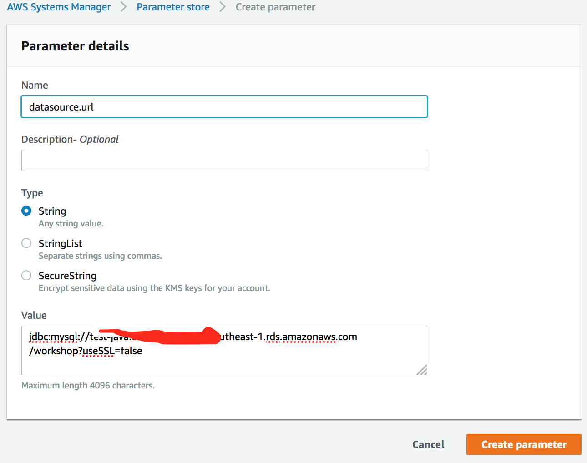
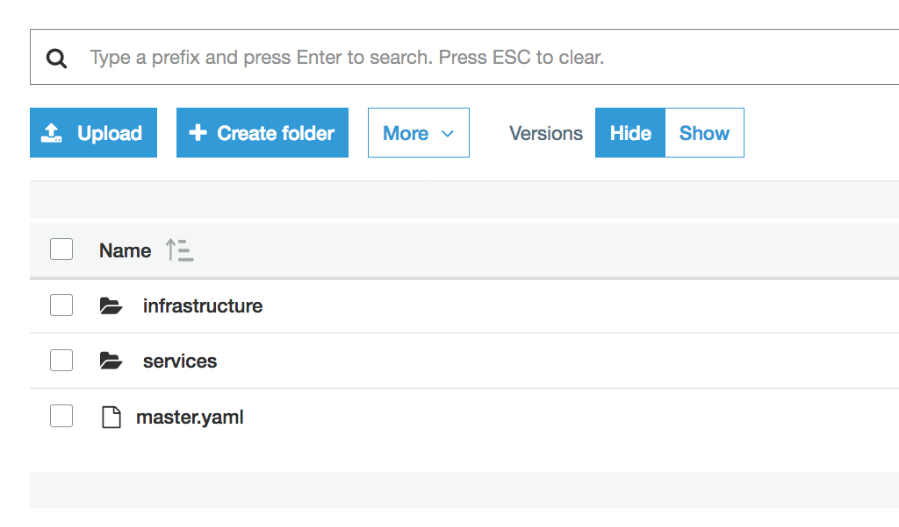
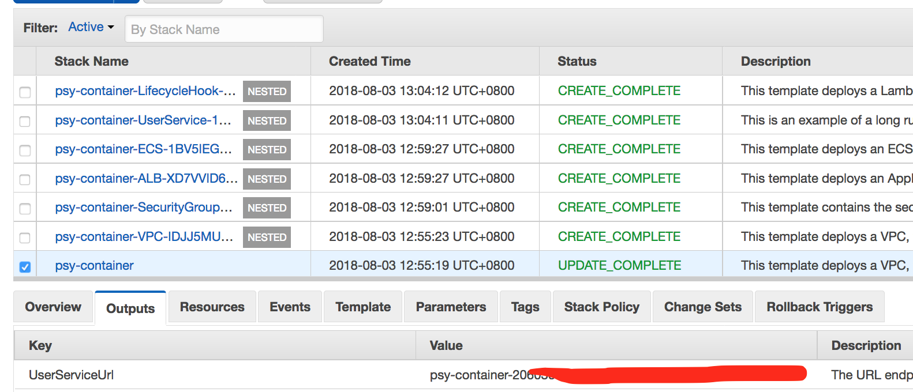
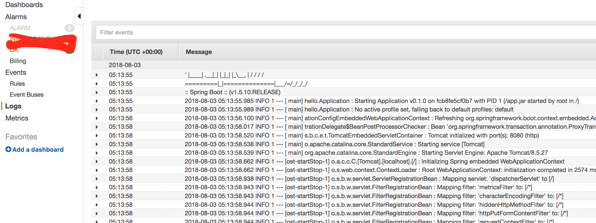

# 2018 APJC Tech Summit in Macau - Java microservice migration 

<hr>

# Table of Contents
1. [Overview of This Workshop](#Overview-of-This-Workshop)  
1.1 [Basic Steps of Migration](#Basic-Steps-of-Migration)  
1.2 [Practical Steps for Java application migration](#Practical-Steps-for-Java-application-migration)
2. [Preparation](#Preparation)  
2.1 [Full installation(Recommeded)](#Full-installation)  
2.2 [Using AMI](#Use-an-AMI)
3. [Labs : Migration from Monolithic to Microservice](#Labs-:-Migration-from-Monolithic-to-Microservice)  
3.1 [Workshop Steps](#Workshop-Steps)  
3.2 [Lab-1](#Lab-1)  
3.3 [Lab-2](#Lab-2)  
3.4 [Lab-3](#Lab-3)  
3.5 [Lab-4](#Lab-4)  
3.6 [Lab-5](#Lab-5)


# Overview of This Workshop

- This workshop introduce the fundamental concenpt and steps for the migration from Java Monolithic application to microservices on AWS environment.
- The simple platform or code changing is not able to fullfill the requirement of migration to the microservies


## Basic Steps of Migration
1. Identify Domains and data (Domain Decomposition)
2. Migrate database (Splitting data/ database refactoring)    
3. Select best platform for microservices  
4. Change your application

## Practical Steps for Java application migration
1. Create a HTTP endpoints
2. Externalize Configuration
3. Expose Application Metrics and Information
4. Deploy Microservices at Scale with Docker and ECS/EKS
5. Cluster Management  
Service Discovery  
Failure Mangement, Circuit Breaker pattern, Load Balancing

6. Logging, Tracing, Metric Monitoring, CI/CD, Configuraiton management


# Preparation

## Full installation
The minimal tools required in this workshop is as follows
Eclipse IDE is optional as your dev IDE for studying this workshop but not mandatory

### Install all required SDK and tools

**Mandatory**  
1. Java SDK 8 or above  
2. Git client, 
3. Maven (3.5.3)
4. AWS CLI : https://docs.aws.amazon.com/cli/latest/userguide/installing.html
5. Docker 
6. MySql Client 

**Optional**  
- Eclipse Oxygen 3 or above
- AWS plugin for Eclipse  : https://docs.aws.amazon.com/toolkit-for-eclipse/v1/user-guide/setup-install.html


## Use an AMI

# Labs : Migration from Monolithic to Microservice

## Workshop Steps

1. Lab-1 : Create a HTTP endpotins 
2. Lab-2 : Externalize Configuration / Expose Application Metrics and information
3. Lab-3 : Splitting projects 
4. Lab-4 : Create a docker image and push it to ECR
5. Lab-5 : Create a ECR
6. Lab-6 : Logging and Service Discovery (optional)

### Use Virginia-region (us-east-1)

<hr>

## Lab-1
- Create a HTTP endpotins 

### Table of Contents
1. [First application](#First-application)  
1.1 [Download codes](#Download-codes)  
1.2 [Compile and package](#Compile-and-package)  
1.3 [Run your application](#Run-your-application)  
2. [Test the application](#Test-the-application)  
2.1 [Check HTTP endpoints for USER data with CURL](#Check-HTTP-endpoints-for-USER-data-with-CURL)  
2.2 [Check HTTP endpoints for IMAGE data with CURL](#Check-HTTP-endpoints-for-IMAGE-data-with-CURL)  
2.3 [Check the web pages](#Check-the-web-pages)
3. [Change Properties(optional)](#Change-Properties(optional))  
3.1 [Change H2 password](#Change-H2-password)  
3.2 [Change application.properties](#Change-application.properties)

### First application

#### Download codes

```
git clone https://github.com/aws-asean-builders/APJC-TechSummit-2018-java-microservice-workshop.git
```

#### Compile and package

1. Change working directory to module-01
	
```
cd <work_space>/module-01
```

2. Compile and package without unit testing(recommended)

```
mvn compile package -Dmaven.test.skip=true

```
	
#### Run your application 
	
```
java -jar target/module-01-0.1.0.jar
```

### Test the application
Run MainControllerTest with JUnit Runner and check the console output and it's result. if you get a error messages then take a look at how to fix the problem.
We have 2 kinds of unit test, one is mock test, the other is integration test, please check 2 files in test folder.


#### Check HTTP endpoints for USER data with CURL 
Launch your application in your Eclipse IDE and run 'curl' command like below

```
# test user
curl 'localhost:8080/workshop/users/all'

curl 'localhost:8080/workshop/users/add?name=First&email=ex1@gmail.com'

curl 'localhost:8080/workshop/users/deleteall'

curl 'localhost:8080/workshop/users/all'
```

#### Check HTTP endpoints for IMAGE data with CURL 
```
curl 'localhost:8080/workshop/images/all'

curl 'localhost:8080/workshop/images/add?userid=1&bucket=seon-singapore&prefix=/output&filename=test.PNG'

curl 'localhost:8080/workshop/images/deleteall'

curl 'localhost:8080/workshop/images/all'

```

#### Check HTTP endpoints for Photo data with CURL 
```
curl 'localhost:8080/workshop/photos/all'

```


#### Check the web pages
Open *localhost:8080*  

Open *localhost:8080/users/add*, *localhost:8080/users*


### Change Properties(optional)
#### Change H2 password
**If you have enough time, Procced this section, if not, skip this section.**

Currently we are using H2 database. If you want to change this database to MySQL in local then, please see application.properties.

1. Connect H2 console (http://localhost:8080/h2)
2. Specify JDBC URL "jdbc:h2:file:~/WorkshopDB"
3. User Name : **sa**
4. Password : *none*


5. Change password to "12345678"

```
ALTER USER sa SET PASSWORD '12345678';
```

#### Change application.properties

Please see application.properties in **moudle-01/src/main/resources**

1. Specify password value

``` 
spring.datasource.password=12345678
```
2. Re-launch application

```
mvn compile package -Dmaven.test.skip=true

java -jar target/module-01-0.1.0.jar

```

<hr>

## Lab-2

- Externalize Configuration / Expose Application Metrics and information

### Table of Contents
1. [Run application (module-02)](#Run-application-(module-02))
2. [Externalize Configuration](#Externalize-Configuration)     
2.1 [Configure AWS CLI(Optional)](#Configure-AWS-CLI(Optional))  
2.2 [Configure ParameterStore in System Manager](#Configure-ParameterStore-in-System-Manager)  
2.3 [Run your application again](#Run-your-application-again)  
3. [Expose Application Metrics and Information](#Expose-Application-Metrics-and-Information)  
3.1 [Check Application Info](#Check-Application-Info)

### Run application (module-02)

```
cd module-02
mvn compile package -Dmaven.test.skip=true
java -jar target/module-02-0.1.0.jar
```
 
- **You definitely got error above, it is because you don't have Parameter Stores**
- You need to create this following step 2

1. Configure Your Parameter Store
2. Check your EC2 roles (If you have errors after creating parameters in Parameter Store, then check it)
 
### Externalize Configuration 


#### Configure AWS CLI(Optional)
If you didn't configure AWS CLI, then install or uprate your AWS CLI 
**If you configured AWS CLI configuraiton before, then skip this 1.1 

```
> aws configure
> AWS Access Key ID [None]: [your key]
> AWS Secret Access Key [None]: [your key]
> AWS region : [your region]
```

#### Configure ParameterStore in System Manager 
- AWS Systems Manager Parameter Store provides secure, hierarchical storage for configuration data management and secrets management. You can store data such as passwords, database strings, and license codes as parameter values.
Complete the following tasks to configure application parameters for ParameterStore (select your region, for example, us-east-1, ap-southeast-1 and so forth)


1. Open the System Manager Cosole and go to Parameter Store
2. Create parameters in ParameterStore for database URL, database username and password in your region
3. Specify **datasource.url** as **jdbc:h2:file:~/WorkshopDB**
4. Specify **datasource.username** as **sa**
5. Specify **datasource.password** as **12345678**



#### Run your application again

Check your EC2 role, if you have errors after creating parameters in Parameter Store.

### Expose Application Metrics and Information
We are using "spring-boot-starter-actuator", please check application metrics and information using following command

#### Check Application Info

Http endpoints for acutuator are differnt based on spring version.

If it is Spring 1.5x,

```
curl localhost:8080/heath
curl localhost:8080/beans
```

If it is Spring 2.0.x

```
curl localhost:8080/actuator/info
curl localhost:8080/actuator/health
curl localhost:8080/actuator/metrics
```

Also you need to change application.properites according to the version of Spring.

1.5x
```
#actuator for spring 1.5
endpoints.actuator.enabled=true
management.security.enabled=false
```

2.0x
```
#actuator for spring 2.x
endpoints.actuator.enabled=true
management.endpoints.web.exposure.include=*
management.endpoints.web.exposure.exclude=env
```
<hr>

## Lab-3
- Splitting projects into services

### Table of Contents
1. [Run your appplications](#Run-your-appplications)  
1.1 [Compile and run 2 applications](#Compile-and-run-2-applications)   
1.2 [Test your HTTP endpoints with CURL](#Test-your-HTTP-endpoints-with-CURL)
2. [Create a Mysql DB](#Create-a-Mysql-DB)  
2.1 [Create an Aurora MySQL instance](#Create-an-Aurora-MySQL-instance)  
2.2 [Install MySQL Client and Create a new user](#Install-MySQL-Client-and-Create-a-new-user)  
2.3 [Configure ParameterStore in System Manager](#Configure-ParameterStore-in-System-Manager)
3. [Create a Dynamo Database table](#Create-a-Dynamo-Database-table)  
3.1 [Create a Table](#Create-a-Table)  
3.2 [Run and check](#Run-and-check)

### Run your appplications

#### Compile and run 2 applications
We have 2 projects (module-03-ddb, modlue-03-mysql).
Comple and run both application

```
cd <work_space>/module-03-ddb
mvn compile package -Dmaven.test.skip=true
java -jar target/module-03-ddb-0.1.0.jar
```

```
cd <work_space>/module-03-mysql
mvn compile package -Dmaven.test.skip=true
java -jar target/module-03-mysql-0.1.0.jar
```

#### Test your HTTP endpoints with CURL

```

```

### Create a Mysql DB

#### Create an Aurora MySQL instance

1. Open the Amazon RDS console : https://console.aws.amazon.com/rds/home?region=us-east-1#
2. Select Aurora for MySQL 5.7 Database engine and select the 
3. Create a DB instance configuring database name, username, password.
4. Remember your master username and password to perform next step
	


5. Create database in configuration page (for example, workshop)
	
Name your Aurora database as TSA-Workshop, and keep the rest of the values as default.
- Select db instances of your choice (e.g. db.t2.micro)
- Keep the default multi-AZ
- Cluster name: TSA-Workshop-Cluster
- Database name: workshop
- Speicfy master user id and password and remember it
- Make sure that the database is publicly accessible.
- Keep everything else as default and then launch the Aurora database.
- At your left panel, click on the 'instances' menu. You should see that RDS is creating two database instances for you (one reader and writer role respectively).

6. Wait until completing the creation of Aurora for MySQL 

Endpoint looks like this - "tsa-workshop.ctdltt3xxxx.us-east-1.rds.amazonaws.com"
	
7. Check Endpoint and Security Group
	

	
8. Change Security Group configuration, if you need.
9. Check connectivity from your local computer (if you don't have any MySQL client, please install it)

#### Install MySQL Client and Create a new user

1. Install MySQL using Brew
2. Login MySQL with master id & password
```
brew install mysql

mysql -h <endpoint of your instance> -u <master username> -p
```
	
2. Create user and it's privilege using following SQL commands(use MySQL client in your computer)

```
mysql> create user 'demouser'@'%' identified by '12345678'; -- Creates the user
mysql> grant all on workshop.* to 'demouser'@'%'; -- Gives all the privileges to the new user on the newly created 
```

3. Check the tables, there is no table yet.

```
show tables;

```


#### Configure ParameterStore in System Manager 

AWS Systems Manager Parameter Store provides secure, hierarchical storage for configuration data management and secrets management. You can store data such as passwords, database strings, and license codes as parameter values.
Complete the following tasks to configure application parameters for ParameterStore (default region is us-east-1)

1. Open the Amazon EC2 console at https://console.aws.amazon.com/ec2/
2. Change values in ParameterStore for database URL, database username and password

- datasource.url = jdbc:mysql://<your_db_endpoint>/workshop?&useSSL=false
- datasource.username = demouser
- datasource.password = 12345678
	


3. Add datasource.url, datasource.username, datasource.password for your Aurora instance. 
4. Specify values as you configured in previous steps.


#### 2.3 Run your application again 
Run Module-03-mysql.
After running, check tables of workshop database in MySQL Client

```
user workshop;

show tables;

select * from User;

```

### Create a Dynamo Database table

#### Create a Table (optional)
- Application (module-03-ddb) will create PhotoInfo table automatically.

1. Create a "PhotoInfo" table
2. Specify "id" as a primary partition key


#### Run and check
Run Module-03-ddb and check it again

```
curl localhost:8080/workshop/photos/all

```

<hr>


## Lab-4
- Create a docker image and push it to ECR
### Table of Contents
1. [Building docker](#Building-docker)  
1.1 [Install docker tools (optional)](#Install-docker-tools-(optional))   
1.2 [Create and test](#Create-and-test)  
1.3 [More commands for Debug (Optional)](#More-commands-for-Debug-(Optional))
2. [ECR](#ECR)  
2.1 [Create an ECR repository](#Create-an-ECR-repository)  
2.2 [Push your images](#Push-your-images)  
2.3 [Check the pushed image](#Check-the-pushed-image)


### Building docker

Reference : 
https://docs.aws.amazon.com/AmazonECS/latest/developerguide/docker-basics.html#docker-basics-create-image

#### Install docker tools (optional)

If you are able to use YUM, then use following command
```
sudo yum install -y docker
```

#### Create and test

1. Check a Dockerfile

Dockerfile in **module-04**

```
FROM openjdk:8-jdk-alpine
VOLUME /tmp
ARG JAR_FILE
COPY ${JAR_FILE} app.jar
ENTRYPOINT ["java","-Djava.security.egd=file:/dev/./urandom","-jar","/app.jar"]
```

2. Create a docker image
- You need to create 2 docker images for **"module-03-mysql"** and **"module-03-ddb"**
- You need to repeat these steps for module-03-ddb with the name of "photo-service-img"
- 8080 port for module-03-mysql
- 8081 port for module-03-ddb

For example, if you build a docker img of module-03-mysql.	
```	
cd ../module-04
cp ../module-03-mysql/target/module-03-mysql-0.1.0.jar .

docker build -t user-service-img:latest . --build-arg JAR_FILE="module-03-mysql-0.1.0.jar"

```

3. Run docker in your local machine

Need to pass ACCESS_KEY, SECRET_KEY as environment variable when you run an applicaiton in docker.	

If you want to run it as interactive mode, use following with 8080
```
docker run -p 80:8080 \
-e AWS_ACCESS_KEY_ID='<access-key>' \
-e AWS_SECRET_ACCESS_KEY='<secret-key>' \
-e AWS_REGION='<region>' \
-it user-service-img bash 
```

If you want to run it as daemon mode (module-03-mysql)
```
docker run -d -p 80:8080 -e AWS_ACCESS_KEY_ID='<access-key>' \
-e AWS_SECRET_ACCESS_KEY='<secret-key>' \
-e AWS_REGION='<region>' \
--name=user-service user-service-img

```

When you run module-03-ddb docker, use 8081

```
docker run -p 80:8081 \
-e AWS_ACCESS_KEY_ID='<access-key>' \
-e AWS_SECRET_ACCESS_KEY='<secret-key>' \
-e AWS_REGION='<region>' \
-it photo-service-img bash 
```


4. Check running docker and stop it
```
docker ps

docker stop <CONTAINER ID>
```

5. Remove all container

```
#stop all running docker
docker stop $(docker ps -a -q)

# Delete all containers
docker rm $(docker ps -a -q)

# Delete all images
docker rmi $(docker images -q)
```

#### More commands for Debug (Optional)

1. List stack:

```
docker stack ls
```

2. List services in the stack:

```
docker stack services myapp
```

3. List containers:

```
docker container ls -f name=myapp*
```

4. Get logs for all the containers in the webapp service:

```
docker service logs myapp_webapp-service
```


### ECR

#### Create an ECR repository

1. Run a following AWS CLI command

```
aws ecr create-repository --repository-name user-service-repo	

aws ecr create-repository --repository-name photo-service-repo
	
```
2. Check response and save a repository ARN

```
{
    "repository": {
        "registryId": "<account-id>.", 
        "repositoryName": "user-service-repo", 
        "repositoryArn": "arn:aws:ecr:us-east-1:<account id>:repository/user-service-repo", 
        "createdAt": 1516947869.0, 
        "repositoryUri": "<account-id>.dkr.ecr.us-east-1.amazonaws.com/user-service-repo"
    }
}

```

3. Get Authentication

```
aws ecr get-login --no-include-email --region us-east-1 | sh
```

#### Push your images

```
docker tag user-service-img:latest  <aws_account_id>.dkr.ecr.<your_region>.amazonaws.com/user-service-repo:latest 

docker push  <aws_account_id>.dkr.ecr.<your_region>.amazonaws.com/user-service-repo:latest
```


#### Check the pushed image

1. You can describe the images in a repository using following command.

```
aws ecr describe-images --repository-name user-service-repo

```

2. Pull the image using the docker pull (optional)

```
docker pull <aws_account_id>.dkr.ecr.<your_region>.amazonaws.com/user-service-repo:latest

docker images 

docker run -d -p 80:8080 --name=user-service <IMAGE_ID>

docker ps
```
<hr>

## Lab-5
- Create a ECR
- We assume there are 2 ECR repo : **user-service**, **photo-service**
<br>

- We can create ECR stack using CloudFormation and also update it
- ECS has the ability to perform rolling upgrades to your ECS services to minimize downtime during deployments. For more information, see Updating a Service.
- To update one of your services to a new version, adjust the Image parameter in the service template (in services/* to point to the new version of your container image. 
- After you've updated the template, update the deployed CloudFormation stack; CloudFormation and ECS handle the rest.

### Table of Contents
1. [Create a Stack using CloudFormation](#Create-a-Stack-using-CloudFormation)  
1.1 [Create a S3 bucket](#Create-a-S3-bucket)   
1.2 [Change a S3 paths in files](#Change-a-S3-paths-in-files)  
1.3 [Upload step-01 files](#Upload-step-01-files)  
1.4 [Check the result](#Check-the-result)

2. [Update a ECR Stack using CloudFormation](#Update-an-ECR-Stack-using-CloudFormation)  
2.1 [Add new service](#Add-new-service)  

### Create a Stack using CloudFormation

#### Create a S3 bucket
1. Create a bucket in your region
2. Create a folder in your bucket, for example, **<your_bucket>/ecr-cfn**

#### Change a S3 paths in files
1. Change a S3 bucket path of master.yaml in step-01 and step-02

For example, 
```
      Properties:
            TemplateURL: https://<s3-region>.amazonaws.com/<your-bucket>/ecs-cfn/infrastructure/vpc.yaml
```
You should change all S3 paths in master.yaml

2. Change a image repo URL in step-01/services/user-service/service.yaml

```
TaskDefinition:
    Type: AWS::ECS::TaskDefinition
    Properties:
        Family: user-service
        ContainerDefinitions:
            - Name: user-service
                Essential: true
                Image: <your imge repo url>
                Memory: 512
        

```

#### Upload step-01 files
1. Uploda step-01 files onto your bucket folder.


#### Create a Stack using CloudFormation
1. Specify the input file URL as your master.yaml URL
2. Specify stack name, for example, 'APJC-workshop'


#### Check the result
1. Wait for the completion of creation (it will take about 10 ~ 15mins)
2. Check the output tab in CloudFormation


3. Check the target groups in EC2 menu.
4. Check the CloudWatch logs.

### Update an ECR Stack using CloudFormation

##### Add new service
We will add one more serice, photo-service
1. Check a **step-02** Cloufformation files.
2. Check the differences with **step-01**

- Changes

1. Added a new service in master.yml 
```
    UserService:
        Type: AWS::CloudFormation::Stack
        Properties:
            TemplateURL: https://s3-us-east-1.amazonaws.com/<your bucket>/ecs-cloudformation/services/user-service/service.yaml
            Parameters:
                VPC: !GetAtt VPC.Outputs.VPC
                Cluster: !GetAtt ECS.Outputs.Cluster
                DesiredCount: 2
                Listener: !GetAtt ALB.Outputs.Listener 
                Path: /workshop/users*   

```

```
Outputs:

    ServiceServiceUrl: 
        Description: The URL endpoint for the product service
        Value: !Join [ "/", [ !GetAtt ALB.Outputs.LoadBalancerUrl, "workshop/users/all" ]] 
```

2. Added new service.yaml in step-02/servies/photo-service/service.yaml

#### Update the stack
1. Upload all files in step-02 into the bucket
2. Update a stack
3. Check the changes


<hr>

## Lab-6
- Logging, Service Discovery and so forth

### Table of Contents
1. [Configuring Logging](#Configuring-Logging)  
2. [Service Discovery](#Service-Discovery) 

### Configuring Logging
We already have a Log group created in Lab-5
Go to CloudWatch Logs and check the log group <your-created-stack>, for example, "APJC-workshop"



### Service Discovery
- For serice discovery, **us-east-1** region is recommended.

reference : https://docs.aws.amazon.com/AmazonECS/latest/developerguide/create-service-discovery.html

